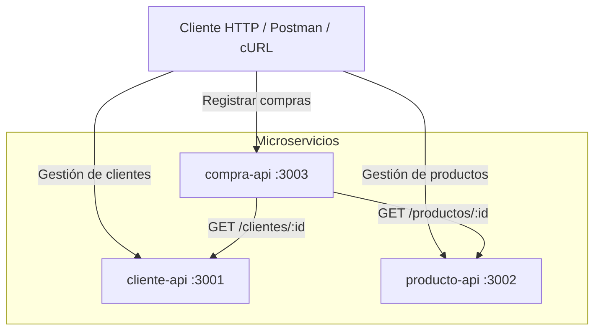
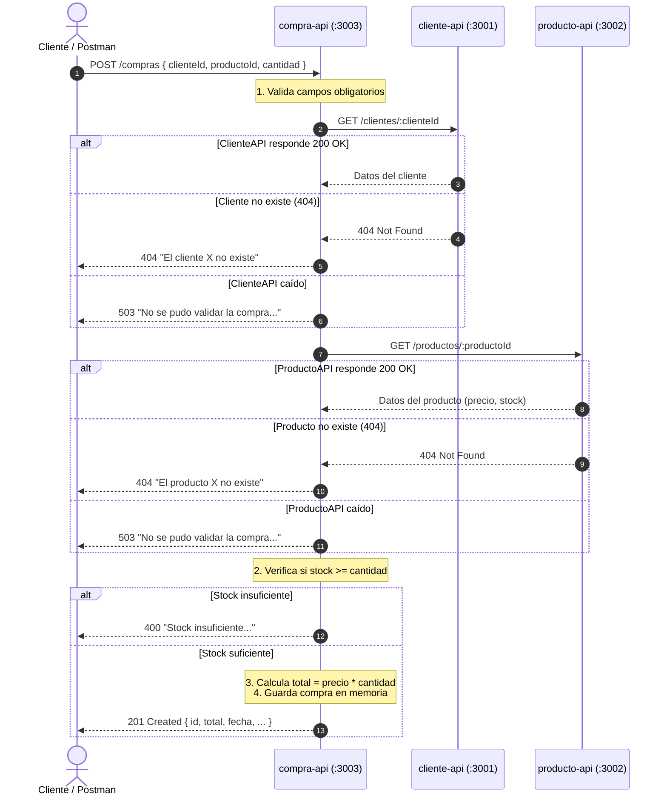

# Taller 2 - Arquitectura de Microservicios en Node.js y Express

Este repositorio contiene una arquitectura básica de backend distribuida en **tres microservicios independientes** construidos con **Node.js** y **Express**, que almacenan su información temporalmente en memoria (In-Memory) y se comunican entre sí mediante peticiones HTTP asíncronas con la API nativa `fetch`.

---

## Tabla de Contenido
1. [Visión General del Sistema](#visión-general-del-sistema)
2. [Estructura del Proyecto](#estructura-del-proyecto)
3. [Explicación Detallada de Archivos y Código](#explicación-detallada-de-archivos-y-código)
   - [Archivos de Raíz](#archivos-de-raíz)
   - [Microservicio 1: cliente-api (Puerto 3001)](#microservicio-1-cliente-api-puerto-3001)
   - [Microservicio 2: producto-api (Puerto 3002)](#microservicio-2-producto-api-puerto-3002)
   - [Microservicio 3: compra-api (Puerto 3003)](#microservicio-3-compra-api-puerto-3003)
4. [Flujo de Intercomunicación entre Servicios](#flujo-de-intercomunicación-entre-servicios)
5. [Requisitos Previos e Instalación](#requisitos-previos-e-instalación)
6. [Cómo Ejecutar los Microservicios](#cómo-ejecutar-los-microservicios)
7. [Guía Completa de Peticiones y Pruebas (cURL / HTTP)](#guía-completa-de-peticiones-y-pruebas-curl--http)
   - [Peticiones a cliente-api](#peticiones-a-cliente-api)
   - [Peticiones a producto-api](#peticiones-a-producto-api)
   - [Peticiones a compra-api](#peticiones-a-compra-api)
   - [Flujo de Prueba Completo de Extremo a Extremo (E2E)](#flujo-de-prueba-completo-de-extremo-a-extremo-e2e)
8. [Códigos de Estado HTTP Utilizados](#códigos-de-estado-http-utilizados)

---

## Visión General del Sistema

El sistema emula una plataforma de comercio electrónico dividida en responsabilidades aisladas:



- **`cliente-api`**: Administra los clientes registrados (alta y consulta).
- **`producto-api`**: Administra el catálogo de productos con stock y precios.
- **`compra-api`**: Orquesta el registro de transacciones. Antes de registrar una compra, realiza llamadas HTTP a `cliente-api` para comprobar que el cliente exista y a `producto-api` para verificar que el producto exista y cuente con stock suficiente.

---

## Estructura del Proyecto

```text
taller2/
├── .env                                  # Variables de entorno de referencia global
├── README.md                             # Documentación completa del proyecto
├── cliente-api/                          # Servicio de clientes (Puerto 3001)
│   ├── .env                              # Configuración local de variables
│   ├── .env.example                      # Ejemplo de variables requeridas
│   ├── .gitignore                        # Reglas de exclusión para Git
│   ├── package.json                      # Metadatos, scripts y dependencias
│   └── src/
│       ├── server.js                     # Punto de entrada de Express
│       ├── data/
│       │   └── clientes.js               # Persistencia de clientes en memoria
│       └── routes/
│           └── clientes.routes.js        # Endpoints y lógica de clientes
├── producto-api/                         # Servicio de productos (Puerto 3002)
│   ├── .env                              # Configuración local de variables
│   ├── .env.example                      # Ejemplo de variables requeridas
│   ├── .gitignore                        # Reglas de exclusión para Git
│   ├── package.json                      # Metadatos, scripts y dependencias
│   └── src/
│       ├── server.js                     # Punto de entrada de Express
│       ├── data/
│       │   └── productos.js              # Persistencia de productos en memoria
│       └── routes/
│           └── productos.routes.js       # Endpoints y lógica de productos
└── compra-api/                           # Servicio orquestador de compras (Puerto 3003)
    ├── .env                              # Configuración y URLs de servicios dependientes
    ├── .env.example                      # Ejemplo de variables requeridas
    ├── .gitignore                        # Reglas de exclusión para Git
    ├── package.json                      # Metadatos, scripts y dependencias
    └── src/
        ├── server.js                     # Punto de entrada de Express
        ├── data/
        │   └── compras.js                # Persistencia de compras en memoria
        ├── services/                     # Clientes HTTP hacia otros servicios
        │   ├── clienteService.js         # Consulta a cliente-api mediante fetch
        │   └── productoService.js        # Consulta a producto-api mediante fetch
        └── routes/
            └── compras.routes.js         # Endpoints y orquestación de compras
```

---

## Explicación Detallada de Archivos y Código

### Archivos de Raíz

#### [`.env`](./.env)
Define variables globales del sistema, puertos asignados y variables de base de datos preparadas para futuras migraciones persistentes:
```ini
CLIENTE_PORT=3001
PRODUCTO_PORT=3002
COMPRA_PORT=3003

DB_HOST=localhost
DB_PORT=5432
DB_USER=postgres
DB_PASSWORD=postgres
DB_NAME=taller2_db
```
- `CLIENTE_PORT`, `PRODUCTO_PORT`, `COMPRA_PORT`: Identifican los puertos estándar de cada servicio.
- `DB_*`: Configuración para una futura conexión a PostgreSQL (no utilizada actualmente ya que los datos residen en memoria).

---

### Microservicio 1: cliente-api (Puerto 3001)

#### [`cliente-api/package.json`](./cliente-api/package.json)
```json
{
  "name": "cliente-api",
  "version": "1.0.0",
  "description": "API de gestión de clientes",
  "main": "src/server.js",
  "scripts": {
    "start": "node src/server.js",
    "dev": "nodemon src/server.js"
  },
  "dependencies": {
    "dotenv": "^18.0.1",
    "express": "^5.2.1"
  },
  "devDependencies": {
    "nodemon": "^3.1.14"
  }
}
```
- `scripts`:
  - `"start"`: Ejecuta la aplicación en modo producción usando el motor nativo de Node.js.
  - `"dev"`: Arranca la aplicación con `nodemon`, reiniciando automáticamente el proceso ante cambios en el código.
- `dependencies`:
  - `dotenv`: Carga variables de entorno desde el archivo local `.env` a `process.env`.
  - `express`: Framework HTTP para gestionar rutas, peticiones y respuestas.
- `devDependencies`:
  - `nodemon`: Herramienta de monitoreo de archivos para desarrollo.

#### [`cliente-api/.env`](./cliente-api/.env)
```ini
PORT=3001
DB_HOST=localhost
DB_PORT=5432
DB_USER=postgres
DB_PASSWORD=postgres
DB_NAME=taller2_db
```
Configura `PORT=3001` para que esta API no colisione con los otros servicios.

#### [`cliente-api/src/data/clientes.js`](./cliente-api/src/data/clientes.js)
```javascript
let clientes = [
  { id: 1, nombre: "Laura Gómez", email: "laura.gomez@example.com" },
  { id: 2, nombre: "Andrés Ruiz", email: "andres.ruiz@example.com" }
];

module.exports = clientes;
```
- Define un arreglo en memoria con dos registros iniciales.
- Se exporta por referencia, lo que permite que las mutaciones realizadas con `clientes.push(...)` se mantengan vivas durante el ciclo de vida del proceso Node.

#### [`cliente-api/src/server.js`](./cliente-api/src/server.js)
```javascript
require("dotenv").config();
const express = require("express");
const clientesRoutes = require("./routes/clientes.routes");

const app = express();
const PORT = process.env.PORT || 3001;

app.use(express.json());
app.use("/clientes", clientesRoutes);

app.get("/", (req, res) => {
  res.status(200).json({ mensaje: "cliente-api activa" });
});

app.listen(PORT, () => {
  console.log(`cliente-api escuchando en el puerto ${PORT}`);
});
```
- **Línea 1 (`dotenv.config()`)**: Inicializa las variables de entorno desde `.env`.
- **Líneas 2-3**: Importa `express` y el enrutador modular de clientes.
- **Línea 5**: Crea la instancia de la aplicación `app`.
- **Línea 6**: Obtiene el puerto configurado o recurre al puerto `3001` por defecto.
- **Línea 8 (`express.json()`)**: Middleware global que analiza automáticamente las solicitudes entrantes con cuerpo en formato JSON (`application/json`) y las adjunta a `req.body`.
- **Línea 9**: Monta el módulo de rutas bajo el prefijo `/clientes`.
- **Líneas 11-13**: Endpoint raíz de salud (`health check`) para verificar que el servicio está vivo.
- **Líneas 15-17**: Enlaza el servidor HTTP al puerto configurado y emite un mensaje en consola.

#### [`cliente-api/src/routes/clientes.routes.js`](./cliente-api/src/routes/clientes.routes.js)
```javascript
const express = require("express");
const router = express.Router();
const clientes = require("../data/clientes");

let siguienteId = 3;

// GET /clientes
router.get("/", (req, res) => {
  res.status(200).json(clientes);
});

// GET /clientes/:id
router.get("/:id", (req, res) => {
  const id = Number(req.params.id);
  const cliente = clientes.find((cliente) => cliente.id === id);

  if (!cliente) {
    return res.status(404).json({ mensaje: "Cliente no encontrado" });
  }

  res.status(200).json(cliente);
});

// POST /clientes
router.post("/", (req, res) => {
  const { nombre, email } = req.body;

  if (!nombre || !email) {
    return res
      .status(400)
      .json({ mensaje: "Los campos 'nombre' y 'email' son obligatorios" });
  }

  const nuevoCliente = { id: siguienteId++, nombre, email };
  clientes.push(nuevoCliente);
  res.status(201).json(nuevoCliente);
});

module.exports = router;
```
- **`router = express.Router()`**: Permite modularizar las rutas de forma desacoplada de `server.js`.
- **`let siguienteId = 3`**: Contador autoincremental en memoria, partiendo en 3 (dado que ya existen los IDs 1 y 2).
- **`GET /` (Ruta final: `/clientes`)**: Retorna el arreglo completo de clientes con código `200 OK`.
- **`GET /:id` (Ruta final: `/clientes/:id`)**:
  - `Number(req.params.id)` convierte el parámetro de URL (string) a número entero.
  - Busca el cliente en el arreglo con `clientes.find(...)`.
  - Si no existe, retorna `404 Not Found` con `{ mensaje: "Cliente no encontrado" }`.
  - Si existe, retorna el objeto del cliente con `200 OK`.
- **`POST /` (Ruta final: `/clientes`)**:
  - Extrae `nombre` y `email` de `req.body`.
  - Valida que ambos campos estén presentes; si alguno falta, responde con `400 Bad Request`.
  - Crea el objeto del nuevo cliente con `siguienteId++`, lo inserta en `clientes` con `.push()` y responde con `201 Created`.

---

### Microservicio 2: producto-api (Puerto 3002)

#### [`producto-api/package.json`](./producto-api/package.json)
Configuración análoga a `cliente-api`, con scripts `start` y `dev`, y dependencias `dotenv`, `express` y `nodemon`.

#### [`producto-api/.env`](./producto-api/.env)
```ini
PORT=3002
DB_HOST=localhost
DB_PORT=5432
DB_USER=postgres
DB_PASSWORD=postgres
DB_NAME=taller2_db
```
Configura `PORT=3002`.

#### [`producto-api/src/data/productos.js`](./producto-api/src/data/productos.js)
```javascript
let productos = [
  { id: 1, nombre: "Teclado mecánico", precio: 180000, stock: 15 },
  { id: 2, nombre: "Mouse inalámbrico", precio: 65000, stock: 30 }
];

module.exports = productos;
```
Almacena el catálogo de productos con sus atributos: `id`, `nombre`, `precio` y `stock` disponible.

#### [`producto-api/src/server.js`](./producto-api/src/server.js)
```javascript
require("dotenv").config();
const express = require("express");
const productosRoutes = require("./routes/productos.routes");

const app = express();
const PORT = process.env.PORT || 3002;

app.use(express.json());
app.use("/productos", productosRoutes);

app.get("/", (req, res) => {
  res.status(200).json({ mensaje: "producto-api activa" });
});

app.listen(PORT, () => {
  console.log(`producto-api escuchando en el puerto ${PORT}`);
});
```
Servidor Express escuchando en el puerto 3002 con el prefijo `/productos` y health check en `/`.

#### [`producto-api/src/routes/productos.routes.js`](./producto-api/src/routes/productos.routes.js)
```javascript
const express = require("express");
const router = express.Router();
const productos = require("../data/productos");

let siguienteId = 3;

// GET /productos
router.get("/", (req, res) => {
  res.status(200).json(productos);
});

// GET /productos/:id
router.get("/:id", (req, res) => {
  const id = Number(req.params.id);
  const producto = productos.find((producto) => producto.id === id);

  if (!producto) {
    return res.status(404).json({ mensaje: "Producto no encontrado" });
  }

  res.status(200).json(producto);
});

// POST /productos
router.post("/", (req, res) => {
  const { nombre, precio, stock } = req.body;

  if (!nombre || precio === undefined || stock === undefined) {
    return res.status(400).json({
      mensaje: "Los campos 'nombre', 'precio' y 'stock' son obligatorios"
    });
  }

  const nuevoProducto = { id: siguienteId++, nombre, precio, stock };
  productos.push(nuevoProducto);
  res.status(201).json(nuevoProducto);
});

module.exports = router;
```
- **`GET /`**: Devuelve todos los productos (`200 OK`).
- **`GET /:id`**: Devuelve el producto por su identificador numérico o `404 Not Found` si no existe.
- **`POST /`**:
  - Valida la presencia de `nombre`, `precio` y `stock` (utiliza `=== undefined` para permitir valores `0` legítimos en stock o precio sin que fallen por evaluación de falsedad).
  - Inserta el producto y devuelve `201 Created`.

---

### Microservicio 3: compra-api (Puerto 3003)

#### [`compra-api/package.json`](./compra-api/package.json)
Configuración de arranque y dependencias idénticas a los servicios anteriores.

#### [`compra-api/.env`](./compra-api/.env)
```ini
PORT=3003
CLIENTE_API_URL=http://localhost:3001
PRODUCTO_API_URL=http://localhost:3002
DB_HOST=localhost
DB_PORT=5432
DB_USER=postgres
DB_PASSWORD=postgres
DB_NAME=taller2_db
```
- `PORT=3003`: Puerto en el que se expone `compra-api`.
- `CLIENTE_API_URL`: URL base para comunicarse con `cliente-api`.
- `PRODUCTO_API_URL`: URL base para comunicarse con `producto-api`.

#### [`compra-api/src/data/compras.js`](./compra-api/src/data/compras.js)
```javascript
let compras = [];

module.exports = compras;
```
Arreglo en memoria vacío que almacena las compras registradas con éxito.

#### [`compra-api/src/services/clienteService.js`](./compra-api/src/services/clienteService.js)
```javascript
const CLIENTE_API_URL = process.env.CLIENTE_API_URL;

async function obtenerCliente(id) {
  const respuesta = await fetch(`${CLIENTE_API_URL}/clientes/${id}`);

  if (respuesta.status === 404) {
    return null;
  }

  if (!respuesta.ok) {
    throw new Error(`cliente-api respondió con estado ${respuesta.status}`);
  }

  return respuesta.json();
}

module.exports = { obtenerCliente };
```
- **Cliente HTTP inter-servicio**:
  - Ejecuta una petición `fetch` asíncrona hacia `http://localhost:3001/clientes/:id`.
  - Si el servicio responde `404 Not Found`, retorna `null` para indicar que el cliente no existe.
  - Si responde con otro código de error (e.g. `500`), lanza una excepción (`throw new Error`).
  - Si la respuesta es exitosa (`200 OK`), parsea y retorna el JSON del cliente.

#### [`compra-api/src/services/productoService.js`](./compra-api/src/services/productoService.js)
```javascript
const PRODUCTO_API_URL = process.env.PRODUCTO_API_URL;

async function obtenerProducto(id) {
  const respuesta = await fetch(`${PRODUCTO_API_URL}/productos/${id}`);

  if (respuesta.status === 404) {
    return null;
  }

  if (!respuesta.ok) {
    throw new Error(`producto-api respondió con estado ${respuesta.status}`);
  }

  return respuesta.json();
}

module.exports = { obtenerProducto };
```
- Mismo patrón que `clienteService.js`, pero apuntando a `PRODUCTO_API_URL/productos/:id`.

#### [`compra-api/src/server.js`](./compra-api/src/server.js)
```javascript
require("dotenv").config();
const express = require("express");
const comprasRoutes = require("./routes/compras.routes");

const app = express();
const PORT = process.env.PORT || 3003;

app.use(express.json());
app.use("/compras", comprasRoutes);

app.get("/", (req, res) => {
  res.status(200).json({ mensaje: "compra-api activa" });
});

app.listen(PORT, () => {
  console.log(`compra-api escuchando en el puerto ${PORT}`);
});
```
Servidor Express escuchando en el puerto 3003 con las rutas montadas bajo `/compras`.

#### [`compra-api/src/routes/compras.routes.js`](./compra-api/src/routes/compras.routes.js)
```javascript
const express = require("express");
const router = express.Router();
const compras = require("../data/compras");
const { obtenerCliente } = require("../services/clienteService");
const { obtenerProducto } = require("../services/productoService");

let siguienteId = 1;

// GET /compras
router.get("/", (req, res) => {
  res.status(200).json(compras);
});

// GET /compras/:id
router.get("/:id", (req, res) => {
  const id = Number(req.params.id);
  const compra = compras.find((compra) => compra.id === id);

  if (!compra) {
    return res.status(404).json({ mensaje: "Compra no encontrada" });
  }

  res.status(200).json(compra);
});

// POST /compras
router.post("/", async (req, res) => {
  const { clienteId, productoId, cantidad } = req.body;

  if (!clienteId || !productoId || !cantidad) {
    return res.status(400).json({
      mensaje: "Los campos 'clienteId', 'productoId' y 'cantidad' son obligatorios"
    });
  }

  let cliente;
  let producto;

  try {
    cliente = await obtenerCliente(clienteId);
    producto = await obtenerProducto(productoId);
  } catch (error) {
    return res.status(503).json({
      mensaje: "No se pudo validar la compra porque uno de los servicios no respondió",
      detalle: error.message
    });
  }

  if (!cliente) {
    return res.status(404).json({ mensaje: `El cliente ${clienteId} no existe` });
  }

  if (!producto) {
    return res.status(404).json({ mensaje: `El producto ${productoId} no existe` });
  }

  if (producto.stock < cantidad) {
    return res.status(400).json({
      mensaje: `Stock insuficiente. Disponible: ${producto.stock}, solicitado: ${cantidad}`
    });
  }

  const nuevaCompra = {
    id: siguienteId++,
    clienteId,
    productoId,
    cantidad,
    total: producto.precio * cantidad,
    fecha: new Date().toISOString()
  };

  compras.push(nuevaCompra);
  res.status(201).json(nuevaCompra);
});

module.exports = router;
```
- **Líneas 9-24 (`GET /` y `GET /:id`)**: Consulta la lista total o una compra puntual por ID.
- **Líneas 27-74 (`POST /`)**: Orquestación distribuida de la compra:
  1. **Validación de campos de entrada**: Verifica que vengan `clienteId`, `productoId` y `cantidad`. Si no, responde con `400 Bad Request`.
  2. **Llamadas concurrentes / sincronizadas a otros servicios**: Envueltas en un bloque `try ... catch`. Si `cliente-api` o `producto-api` están caídos o inalcanzables, captura el error y responde con `503 Service Unavailable`, informando la falla de resiliencia del sistema distribuido.
  3. **Validación de existencia del cliente**: Si `cliente === null`, responde con `404 Not Found` (`El cliente X no existe`).
  4. **Validación de existencia del producto**: Si `producto === null`, responde con `404 Not Found` (`El producto X no existe`).
  5. **Validación de stock**: Si `producto.stock < cantidad`, rechaza con `400 Bad Request` indicando la cantidad solicitada frente a la disponible.
  6. **Cálculo y creación de la compra**:
     - Calcula el `total` (`producto.precio * cantidad`).
     - Asigna una marca de tiempo ISO 8601 (`new Date().toISOString()`).
     - Guarda el objeto en memoria y responde con `201 Created`.

---

## Flujo de Intercomunicación entre Servicios

El siguiente diagrama de secuencia describe paso a paso qué ocurre cuando se solicita registrar una compra:



---

## Requisitos Previos e Instalación

### Requisitos
- **Node.js**: Versión 18.0.0 o superior (Node 18+ incluye soporte nativo para `fetch`, requerido por `clienteService.js` y `productoService.js`).
- **NPM**: Gestor de paquetes incluido con Node.js.

### Instalación de dependencias
Cada microservicio cuenta con su propio `package.json` aislado. Ejecuta la instalación en cada una de las carpetas:

```bash
# 1. Dependencias de cliente-api
cd cliente-api
npm install
cd ..

# 2. Dependencias de producto-api
cd producto-api
npm install
cd ..

# 3. Dependencias de compra-api
cd compra-api
npm install
cd ..
```

---

## Cómo Ejecutar los Microservicios

Dado que son tres procesos de Node.js independientes, debes ejecutarlos en **3 terminales separadas** (o en segundo plano).

### Opción 1: Tres terminales separadas (Recomendado para observar logs)

**Terminal 1 (`cliente-api`):**
```bash
cd cliente-api
npm run dev
# Salida esperada: cliente-api escuchando en el puerto 3001
```

**Terminal 2 (`producto-api`):**
```bash
cd producto-api
npm run dev
# Salida esperada: producto-api escuchando en el puerto 3002
```

**Terminal 3 (`compra-api`):**
```bash
cd compra-api
npm run dev
# Salida esperada: compra-api escuchando en el puerto 3003
```

> [!TIP]
> Si prefieres no usar `nodemon`, puedes ejecutar `npm start` en lugar de `npm run dev`.

---

## Guía Completa de Peticiones y Pruebas (cURL / HTTP)

### Peticiones a cliente-api

#### 1. Health check de cliente-api
```bash
curl -X GET http://localhost:3001/
```
**Respuesta (200 OK):**
```json
{
  "mensaje": "cliente-api activa"
}
```

#### 2. Listar todos los clientes
```bash
curl -X GET http://localhost:3001/clientes
```
**Respuesta (200 OK):**
```json
[
  { "id": 1, "nombre": "Laura Gómez", "email": "laura.gomez@example.com" },
  { "id": 2, "nombre: "Andrés Ruiz", "email": "andres.ruiz@example.com" }
]
```

#### 3. Obtener un cliente existente por ID
```bash
curl -X GET http://localhost:3001/clientes/1
```
**Respuesta (200 OK):**
```json
{
  "id": 1,
  "nombre": "Laura Gómez",
  "email": "laura.gomez@example.com"
}
```

#### 4. Obtener un cliente que NO existe
```bash
curl -X GET http://localhost:3001/clientes/999
```
**Respuesta (404 Not Found):**
```json
{
  "mensaje": "Cliente no encontrado"
}
```

#### 5. Crear un nuevo cliente exitosamente
```bash
curl -X POST http://localhost:3001/clientes \
  -H "Content-Type: application/json" \
  -d '{
    "nombre": "Carlos Mendoza",
    "email": "carlos.mendoza@example.com"
  }'
```
**Respuesta (201 Created):**
```json
{
  "id": 3,
  "nombre": "Carlos Mendoza",
  "email": "carlos.mendoza@example.com"
}
```

#### 6. Error al crear cliente con campos faltantes
```bash
curl -X POST http://localhost:3001/clientes \
  -H "Content-Type: application/json" \
  -d '{
    "nombre": "Incompleto"
  }'
```
**Respuesta (400 Bad Request):**
```json
{
  "mensaje": "Los campos 'nombre' y 'email' son obligatorios"
}
```

---

### Peticiones a producto-api

#### 1. Health check de producto-api
```bash
curl -X GET http://localhost:3002/
```
**Respuesta (200 OK):**
```json
{
  "mensaje": "producto-api activa"
}
```

#### 2. Listar todos los productos
```bash
curl -X GET http://localhost:3002/productos
```
**Respuesta (200 OK):**
```json
[
  { "id": 1, "nombre": "Teclado mecánico", "precio": 180000, "stock": 15 },
  { "id": 2, "nombre": "Mouse inalámbrico", "precio": 65000, "stock": 30 }
]
```

#### 3. Obtener un producto existente por ID
```bash
curl -X GET http://localhost:3002/productos/1
```
**Respuesta (200 OK):**
```json
{
  "id": 1,
  "nombre": "Teclado mecánico",
  "precio": 180000,
  "stock": 15
}
```

#### 4. Obtener un producto que NO existe
```bash
curl -X GET http://localhost:3002/productos/999
```
**Respuesta (404 Not Found):**
```json
{
  "mensaje": "Producto no encontrado"
}
```

#### 5. Crear un nuevo producto exitosamente
```bash
curl -X POST http://localhost:3002/productos \
  -H "Content-Type: application/json" \
  -d '{
    "nombre": "Monitor 24 pulgadas",
    "precio": 650000,
    "stock": 8
  }'
```
**Respuesta (201 Created):**
```json
{
  "id": 3,
  "nombre": "Monitor 24 pulgadas",
  "precio": 650000,
  "stock": 8
}
```

#### 6. Error al crear producto con datos faltantes
```bash
curl -X POST http://localhost:3002/productos \
  -H "Content-Type: application/json" \
  -d '{
    "nombre": "Auriculares"
  }'
```
**Respuesta (400 Bad Request):**
```json
{
  "mensaje": "Los campos 'nombre', 'precio' y 'stock' son obligatorios"
}
```

---

### Peticiones a compra-api

#### 1. Health check de compra-api
```bash
curl -X GET http://localhost:3003/
```
**Respuesta (200 OK):**
```json
{
  "mensaje": "compra-api activa"
}
```

#### 2. Listar todas las compras registradas
```bash
curl -X GET http://localhost:3003/compras
```
**Respuesta (200 OK):**
```json
[]
```

#### 3. Registrar una compra exitosa
Registraremos la compra de 2 unidades del producto `1` (precio individual: 180000) por parte del cliente `1`:
```bash
curl -X POST http://localhost:3003/compras \
  -H "Content-Type: application/json" \
  -d '{
    "clienteId": 1,
    "productoId": 1,
    "cantidad": 2
  }'
```
**Respuesta (201 Created):**
```json
{
  "id": 1,
  "clienteId": 1,
  "productoId": 1,
  "cantidad": 2,
  "total": 360000,
  "fecha": "2026-10-05T17:49:00.000Z"
}
```

#### 4. Obtener una compra por ID
```bash
curl -X GET http://localhost:3003/compras/1
```
**Respuesta (200 OK):**
```json
{
  "id": 1,
  "clienteId": 1,
  "productoId": 1,
  "cantidad": 2,
  "total": 360000,
  "fecha": "2026-10-05T17:49:00.000Z"
}
```

#### 5. Error: Cliente inexistente
```bash
curl -X POST http://localhost:3003/compras \
  -H "Content-Type: application/json" \
  -d '{
    "clienteId": 999,
    "productoId": 1,
    "cantidad": 1
  }'
```
**Respuesta (404 Not Found):**
```json
{
  "mensaje": "El cliente 999 no existe"
}
```

#### 6. Error: Producto inexistente
```bash
curl -X POST http://localhost:3003/compras \
  -H "Content-Type: application/json" \
  -d '{
    "clienteId": 1,
    "productoId": 999,
    "cantidad": 1
  }'
```
**Respuesta (404 Not Found):**
```json
{
  "mensaje": "El producto 999 no existe"
}
```

#### 7. Error: Stock insuficiente
El producto `1` cuenta con 15 unidades en stock. Si solicitamos 100 unidades:
```bash
curl -X POST http://localhost:3003/compras \
  -H "Content-Type: application/json" \
  -d '{
    "clienteId": 1,
    "productoId": 1,
    "cantidad": 100
  }'
```
**Respuesta (400 Bad Request):**
```json
{
  "mensaje": "Stock insuficiente. Disponible: 15, solicitado: 100"
}
```

#### 8. Error: Falla de comunicación o servicio caído (503 Service Unavailable)
Si apagas `producto-api` (Ctrl+C en su terminal) e intentas hacer una compra:
```bash
curl -X POST http://localhost:3003/compras \
  -H "Content-Type: application/json" \
  -d '{
    "clienteId": 1,
    "productoId": 1,
    "cantidad": 1
  }'
```
**Respuesta (503 Service Unavailable):**
```json
{
  "mensaje": "No se pudo validar la compra porque uno de los servicios no respondió",
  "detalle": "fetch failed"
}
```

---

### Flujo de Prueba Completo de Extremo a Extremo (E2E)

Puedes copiar y pegar este bloque secuencial en una terminal para validar todo el ecosistema de golpe:

```bash
# 1. Crear nuevo cliente
curl -s -X POST http://localhost:3001/clientes \
  -H "Content-Type: application/json" \
  -d '{"nombre": "Mariana Rios", "email": "mariana@example.com"}' | jq

# 2. Crear nuevo producto
curl -s -X POST http://localhost:3002/productos \
  -H "Content-Type: application/json" \
  -d '{"nombre": "Silla Gamer", "precio": 450000, "stock": 5}' | jq

# 3. Realizar compra cruzada (Cliente 3 compra 2 unidades de Producto 3)
curl -s -X POST http://localhost:3003/compras \
  -H "Content-Type: application/json" \
  -d '{"clienteId": 3, "productoId": 3, "cantidad": 2}' | jq

# 4. Verificar listado de compras
curl -s -X GET http://localhost:3003/compras | jq
```

---

## Códigos de Estado HTTP Utilizados

| Código | Significado | Escenario de Uso en el Proyecto |
|---|---|---|
| **200 OK** | Solicitud exitosa | `GET /`, `GET /clientes`, `GET /productos`, `GET /compras` |
| **201 Created** | Recurso creado exitosamente | `POST /clientes`, `POST /productos`, `POST /compras` |
| **400 Bad Request** | Datos de entrada inválidos o reglas de negocio no cumplidas | Campos faltantes en el cuerpo JSON, o stock solicitado mayor al disponible |
| **404 Not Found** | Recurso no encontrado | ID de cliente, producto o compra inexistente |
| **503 Service Unavailable** | Servicio externo no disponible | `compra-api` no logra comunicarse con `cliente-api` o `producto-api` |
